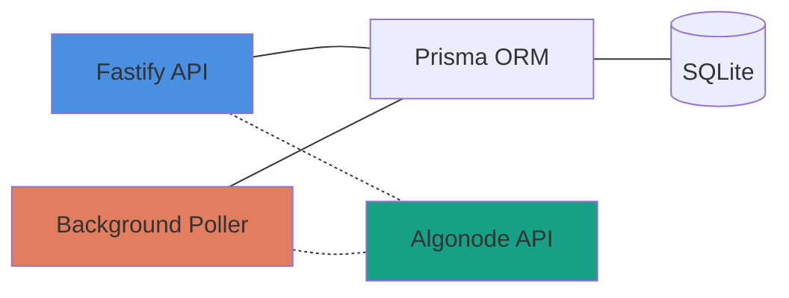
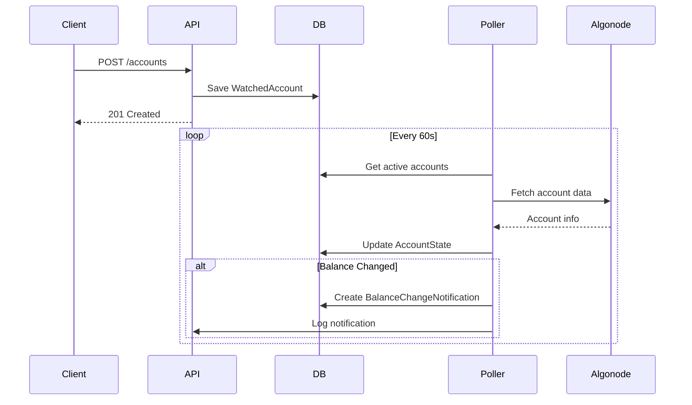
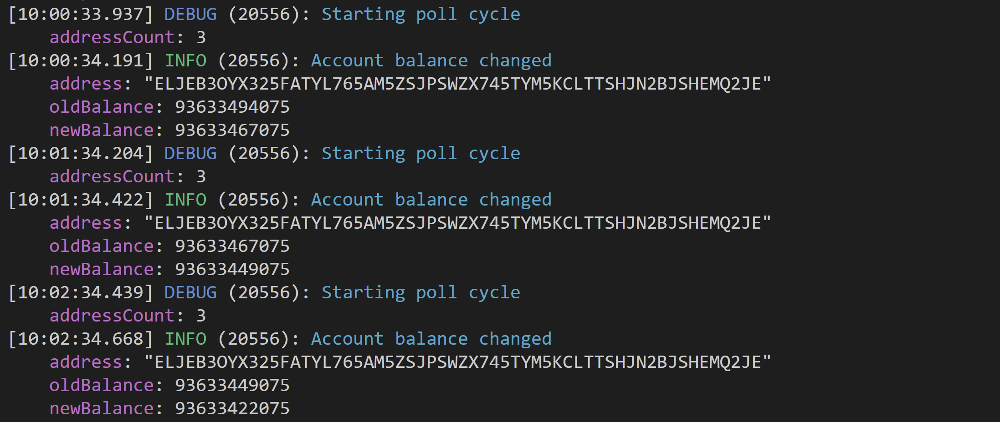

# Algorand Account Watcher

A REST API service that monitors Algorand account balances and logs notifications when changes occur.

**Stack:** Fastify + Prisma (SQLite) + TypeScript

## Quick Overview



**Key Features:**
- ✅ Watch multiple Algorand accounts
- ✅ Background polling every 60s with concurrency control
- ✅ Balance change notifications with full history
- ✅ Health checks for production readiness
- ✅ OpenAPI/Swagger documentation

## Architecture

**Design Decisions:**
- Monitors only `amount` (microAlgos), not full account state
- Single-tenant architecture (one global watch list)
- SQLite for simplicity

### System Flow



### Data model

```
WatchedAccount (1) ──── (1) AccountState
       │
       │
       └──── (N) BalanceChangeNotification
```

## API Reference

### Interactive Documentation

```bash
http://localhost:8080/docs  # Swagger UI
```

### Key Endpoints

| Method | Endpoint | Description |
|--------|----------|-------------|
| GET | `/` | Service information |
| GET | `/health/liveness` | Service health check |
| GET | `/health/readiness` | Database connectivity check |
| POST | `/accounts` | Start watching an account |
| GET | `/accounts` | List all watched accounts with state |

### Example Requests & Responses

**Start watching an account:**
```bash
curl -X POST http://localhost:8080/accounts \
  -H "Content-Type: application/json" \
  -d '{"address": "ELJEB3OYX325FATYL765AM5ZSJPSWZX745TYM5KCLTTSHJN2BJSHEMQ2JE"'
```

Response:
```json
{
  "address": "ELJEB3OYX325FATYL765AM5ZSJPSWZX745TYM5KCLTTSHJN2BJSHEMQ2JE",
  "created": true
}
```

**List all accounts:**
```bash
curl localhost:8080/accounts
```

Response:
```json
[
  {
    "address": "ELJEB3OYX325FATYL765AM5ZSJPSWZX745TYM5KCLTTSHJN2BJSHEMQ2JE",
    "createdAt": "2025-10-12T18:15:15.496Z",
    "unwatchedAt": null,
    "isActive": true,
    "state": {
      "balanceMicro": "93633548075",
      "lastCheckedAt": "2025-10-14T07:57:33.303Z",
      "lastRound": "56504702",
      "errorCount": 0,
      "lastError": null,
      "lastErrorAt": null
    }
  }
]
```

## Quick Start

### System requirements

- NVM (Node Version Management)
- Node.js >= 22.11.0 < 23
- PNPM 10.18.2

### Development

```bash
#1 Clone the repository
git clone git@github.com:imagobea/algo-watcher.git
cd algo-watcher

#2 Install dependencies
nvm use
pnpm install

#3 Configure the environment, adjust if needed
cp .env.example .env

#4 Setup the database
pnpm prisma migrate dev

#5 Start development server
pnpm dev
```

The API will be available at `http://localhost:8080`

### Testing

```bash
# Run tests
pnpm test

# Coverage report
pnpm coverage
```

**Manual Testing:**
1. Start the server (`pnpm dev`)
2. Add an account to watch: `POST /accounts`
3. Find test accounts on [Lora Explorer](https://lora.algokit.io/testnet)
4. Observe poller logs in the terminal



## Project Structure

```
src/
├── server.ts              # Application entry point
├── clients/               # External API clients (Algonode)
├── plugins/               # Fastify plugins (Prisma, Poller, Swagger)
├── repos/                 # Database repositories
├── routes/                # API route handlers
├── services/              # Business logic
└── utils/                 # Shared utilities

prisma/
├── schema.prisma          # Database schema
└── migrations/            # Migration history

test/                      # Vitest test files
```

## Production Considerations

This is a demonstration project. For production use, consider:

- [ ] Authentication & authorization (API keys, OAuth)
- [ ] Rate limiting & request throttling  
- [ ] PostgreSQL instead of SQLite
- [ ] Horizontal scaling (worker processes)
- [ ] Webhook notifications instead of logs
- [ ] API versioning (`/v1/accounts`)
- [ ] Monitoring & alerting (Prometheus, Datadog)
- [ ] Ability to pause/resume account watching
- [ ] Load testing (Apache Bench, k6)
