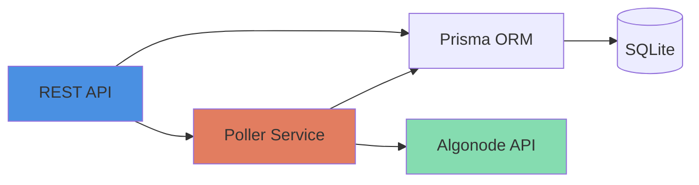

# Algorand Account Watcher

A REST API service that monitors Algorand account balances and logs notifications when changes occur.

**Stack:** Fastify + Prisma (SQLite) + TypeScript

## Quick Overview



**Key Features:**
- ✅ Watch multiple Algorand accounts
- ✅ Background polling every 60s with concurrency control
- ✅ Balance change notifications with full history
- ✅ Health checks for production readiness
- ✅ OpenAPI/Swagger documentation

## Implementation

### App overview

- Monitors account balance changes (i.e., `amount` in microAlgos, not full account state differences)
- Persists data via SQLite database
- Runs a global poller every 60s with concurrency limit
- Designed for single-tenant use (i.e., one global watcher list)

### Data models

`WatchedAccount` (what to track) has a 1:1 `AccountState` (latest snapshot) and 1:N `BalanceChangeNotification` (history).

### API

#### Interactive API docs

Available via Swagger UI:

```bash
# Dev environment
http://localhost:8080/docs
```
It’s automatically generated from the OpenAPI spec, for exploring and testing endpoints directly in the browser.

#### 1. Root

```bash
curl localhost:8080/
```

**Response**:

```json
{
  "name": "Algo Watcher",
  "version": "1.0.0",
  "description": "Watch Algorand accounts and notify on balance changes",
  "docs": "/docs",
  "health": {
    "liveliness": "/health/liveness",
    "readiness": "/health/readiness"
  }
}
```

#### 2. Server liveness

```bash
curl localhost:8080/health/liveness
```

**Response**:

```json
{
  "ok": true
}
```

#### 3. Server readiness

```bash
curl localhost:8080/health/readiness
```

**Response**:

```json
{
  "db": "ok"
}
```

#### 4. POST account (ie start watching)

```bash
curl -X POST http://localhost:8080/accounts \
  -H "Content-Type: application/json" \
  -d '{"address": "ELJEB3OYX325FATYL765AM5ZSJPSWZX745TYM5KCLTTSHJN2BJSHEMQ2JE"}'
```

**Response**:

```json
{
  "address": "ELJEB3OYX325FATYL765AM5ZSJPSWZX745TYM5KCLTTSHJN2BJSHEMQ2JE",
  "created": true
}
```

#### 5. GET accounts

```bash
curl localhost:8080/accounts
```

**Response**:

```json
[
  {
    "address": "ELJEB3OYX325FATYL765AM5ZSJPSWZX745TYM5KCLTTSHJN2BJSHEMQ2JE",
    "createdAt": "2025-10-12T18:15:15.496Z",
    "unwatchedAt": null,
    "isActive": true,
    "state": {
      "balanceMicro": "93633548075",
      "lastCheckedAt": "2025-10-14T07:57:33.303Z",
      "lastRound": "56504702",
      "errorCount": 0,
      "lastError": null,
      "lastErrorAt": null
    }
  }
]
```
## System requirements

- NVM (Node Version Management)
- Node.js vs >= 22.11.0 < 23
- PNPM version 10.18.2

## How to run

### Development

```bash
#1 Clone the repository
git clone git@github.com:imagobea/algo-watcher.git
cd algo-watcher

#2 Install dependencies
nvm use
pnpm install

#3 Copy the environment file and adjust if needed
cp .env.example .env


#4 Setup the database
pnpm prisma migrate dev


#5 Run the project
pnpm dev
```

## How to test

Follow the [development setup instructions](#Development) to get the server running. Use the API endpoints documented above to add accounts to watch (`POST /accounts`). Then observe poller logs on the terminal.

You can discover accounts to track on the [Lora explorer](https://lora.algokit.io/testnet).


## Extensions

- Production access controls
- Api versioning
- Ability to unwatch/rewatch accounts
- Load test
- Observability
